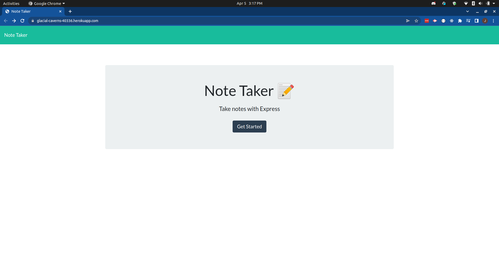
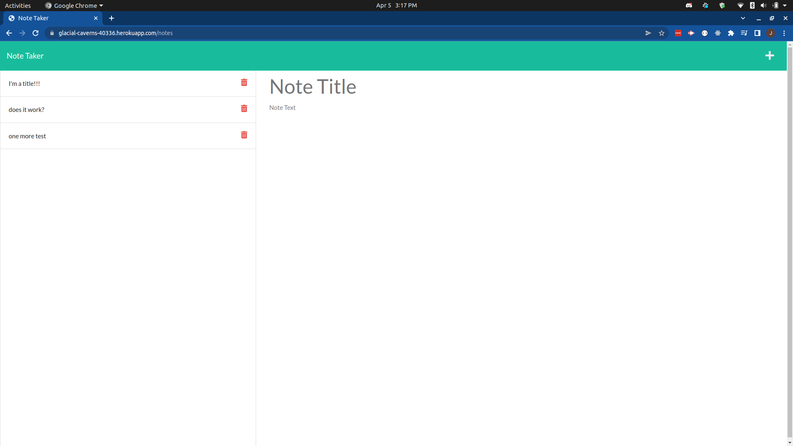

# Note Taker

This application allows a user to write and save notes. 

My role in this project was to create an Express.js back end for the app that saves and retreives note data from a JSON file.

## Built With
* JavaScript
* Express.js
* Node.js

## Screenshot

## Link
https://glacial-caverns-40336.herokuapp.com/

## (Recently Learned) Skills I Used
* Configuring an Express.js back end to serve static HTML files
* Configuring an Express.js back end to create an API to handle GET and POST requests
* Parsing parameters in server-side routes
* Submitting form data to a server
* Implementing separation of concerns for routing
* Deploying a server-side application to Heroku
